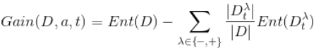

# 决策树与随机森林

## 1. 决策树

### 1.1 基本流程

+ 决策树既可以做分类，又可以做回归。
+ 决策树的生成是一个递归过程

### 1.2 划分选择

+ 如何选择最优划分属性

#### 1.2.1 信息增益

**熵**

熵值越小，纯度越高

**信息增益**

信息增益越大，则意味着用属性a来进行划分所获得的纯度提升越大

**ID3**决策树学习算法，根据信息增益为准则来选择划分属性

#### 1.2.2 增益率

信息增益准则对可取值数目较多的属性有所偏好，增益率用来改善

增益率

IV为属性a的固有值，一般数目越多，这个值会越大

C4.5决策树学习算法，根据增益率来选择最优划分属性

#### 1.2.3 基尼指数

基尼值

基尼值越小，数据集纯度越高

### 1.3 剪枝处理（==代码实现==）

剪枝 - 应对 “过拟合”

基本策略

+ 预剪枝（自顶向下）
  + 在决策树**生成过程**中，对每个结点在划分钱先进行估计，若当前节点的划分不能带来决策树 泛化性能 提升，则停止划分并记为叶子节点
+ 后剪枝（自底向上）
  + 先生成一棵完整的决策树，然后自底向上对非叶节点进行考察

#### 1.3.1 预剪枝

如何判断决策树泛华性能是否提高？

+ 可以采用各种性能评估方法，留出法，交叉验证法

#### 1.3.2 后剪枝

#### 1.3.3 对比

+ 预剪枝是自顶向下的，在建树的过程中，进行判断，可以很好的保证过拟合的风险
+ 后剪枝是自底向上的，一般比预剪枝保留更多的根治，一般来说欠拟合风险很小，泛化能力也一般优于预剪枝，但是因为是在生产完全决策树之后进行，所以一般开销较大

### 1.4 连续与缺失值

#### 1.4.1 连续值处理

> 之前讨论的都是离散值，在现实中，连续属性也很常见

+ **对连续属性离散化**，最简单的策略是采用**二分法**（C4.5决策树算法中的机制）对连续属性进行处理。

+ 二分法思想（==代码实现==）

  + 给定样本集D和连续属性a，假设a在D上出现了n个不同的取值，将这
    些值从小到大进行排序，记为{α1,α2,...,an}.

  + 基于划分点t 可将D 分为于集D~t~^+^和D~t~^-^，其中D~t~^-^包含那些在属性α上取值不大于t 的样本,而D~t~^+^则包含那些在属性a上取值大于t 的样本.

  + 对相邻的属性取值a~i~与a~i+1~来说，t在区间[a~i~,a~i+1~) 中取任意值所产生的划分结果相同

  + 因此，候选划分集合含有 n-1 个元素

    

  + 然后像离散属性值一样考虑这些划分点

    

#### 1.4.2 缺失值处理（==代码实现==）

需解决两个问题

+ 如何在属性值缺失的情况下进行划分属性选择？
+ 给定划分属性，若该样本在该属性上的值缺失，如何对样本进行划分？

在C4.5算法中（例子）

+ 求出某个属性（比如色泽）上无缺失值（14/17）的样例子集的信息熵

  

+ 分别求出该属性下的子属性（比如：青绿、乌黑、浅白）上无缺失值的样例子集的信息熵

+ **样本子集**上属性“色泽”的信息增益为

+ 在**样本集**D上属性为“色泽”的信息增益为

## 2. 随机森林

