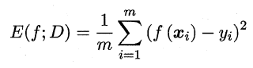
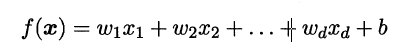
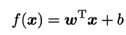
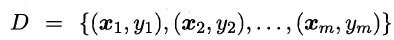
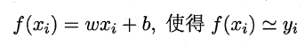

# 线性模型

## 0. 准备

性能度量

+ 什么是性能度量

  + 衡量模型泛化能力的评价标准

+ 在预测任务中，就是要将预测结果和真实标记进行比较

+ 回归任务，最常用的是 “均方误差”

  

## 1. 基本形式

线性模型是一个通过属性的线性组合来进行预测的函数

一般用向量形式

## 2. 线性回归

给定的数据集，线性回归试图学得一个线性模型以尽可能准确地预测实值输出标记。

假设输入属性的数目只有一个，线性回归试图学得

